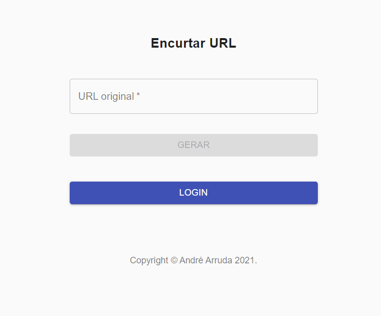
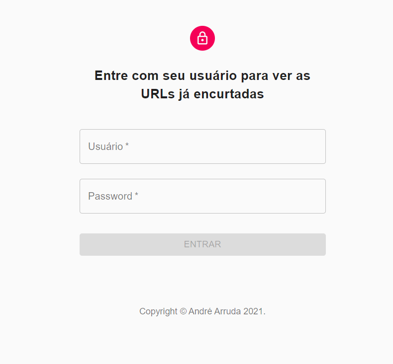
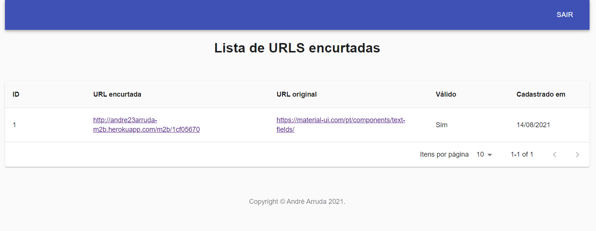
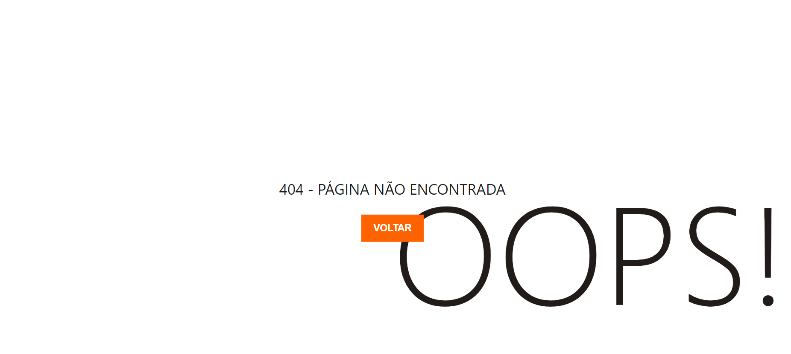

<h1 align="center">
    
</h1>

<h4 align="center">
  	Encurtador de URLs (Frontend)
</h4>

<p align="center">
	<a href="#-tecnologias">Tecnologias</a>&nbsp;&nbsp;&nbsp;|&nbsp;&nbsp;&nbsp;
	<a href="#-projeto">Projeto</a>&nbsp;&nbsp;&nbsp;|&nbsp;&nbsp;&nbsp;
	<a href="#instalação">Instalação</a>
</p>

## 🚀 Tecnologias

Esse projeto foi desenvolvido com as seguintes tecnologias:
- [React](https://reactjs.org)

## 💻 Projeto
**Frontend que consome API para salvar e encurtar URLs**

## Instalação
### Pré requisitos
Ter instalado:
- [Yarn](https://classic.yarnpkg.com/en/docs/install/)

#### No terminal, rodar
```sh
# Entrar na pasta dos arquivos do frontend
cd frontend

# Instalar os pacotes do projeto
yarn install

# Rodar
yarn start
```

<h1 align="center">
    
</h1>

<h1 align="center">
    
</h1>

<h1 align="center">
    
</h1>

<h1 align="center">
    
</h1>
